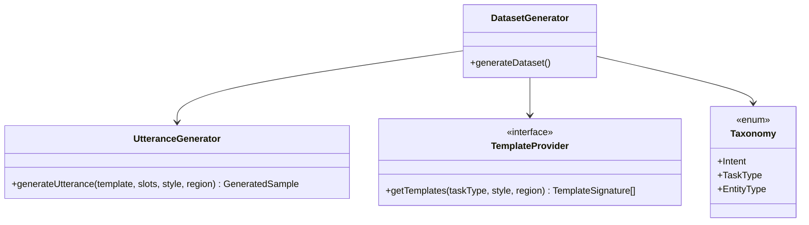
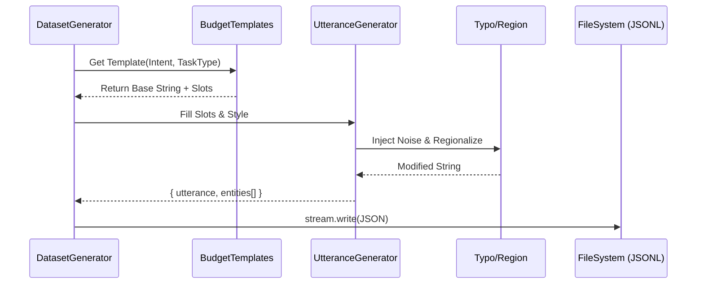

# V6 NLP Architecture Migration Guide

This document outlines the detailed architecture, refactoring strategy, and scalability roadmap for the V6 Hierarchical Intent Generation Pipeline.

## 1. File-by-File Migration Plan

| Current System | Target V6 System | Reason for Migration |
|-----------------|------------------|----------------------|
| `generate_dataset.ts` | `src/generators/DatasetGenerator.ts` | The monolith is broken down. The orchestrator now simply manages loops and writes to JSONL. |
| (Inline Arrays) | `src/taxonomy/intents.ts`, `taskTypes.ts` | Separated domain taxonomy from logic. |
| (Inline Arrays) | `src/taxonomy/backendActions.ts` | Enforces the 1:1 mapping of Intent+TaskType to a specific action. |
| `generateTemplates()` | `src/templates/*Templates.ts` | Each financial domain gets its own file to prevent a 5000-line monolith. |
| `buildSentence()` | `src/generators/UtteranceGenerator.ts` | Standardized slot filling, styling, and entity tagging. |
| (Manual noisy logic)| `src/utils/typoGenerator.ts`, `regionalization.ts` | Shared utilities to scale randomness and typo injections uniformly. |

## 2. Refactoring Strategy
- **Decoupling**: Data definitions (Templates) are purely decoupled from execution logic (Generators).
- **Streams over Memory**: The old `generate_dataset.ts` collected all items into memory and called `JSON.stringify()`. We are moving to `JSONL` (JSON Lines) streams using `fs.createWriteStream()` so generating 3.8 Million records does not crash Node.js (OOM).
- **Procedural Explosion**: Rather than paying an LLM API to generate millions of rows, we use a procedural combinatorial explosion algorithm (Template × Style × Region × Typo).

## 3. Code Examples

**Mapping Intent + TaskType to BackendAction:**
```typescript
if (intent === Intent.BUDGET_PLANNING && taskType === TaskType.ANALYSIS) {
  return "ANALYZE_BUDGET_OVERRUN"; // Resolves purely structurally
}
```

## 4. Dependency Graph

```mermaid
graph TD
    A[DatasetGenerator.ts] --> B[UtteranceGenerator.ts]
    A --> C[Template Engine (*Templates.ts)]
    A --> D[Taxonomy (Intents, TaskTypes)]
    B --> E[Regionalization Utils]
    B --> F[Typo Generator]
```

## 5. Class Diagram



## 6. Folder Structure

```
src/
├── config/
│   └── generationConfig.ts
├── generators/
│   ├── DatasetGenerator.ts
│   ├── EntityGenerator.ts
│   ├── TaskTypeGenerator.ts
│   └── UtteranceGenerator.ts
├── taxonomy/
│   ├── backendActions.ts
│   ├── entityTypes.ts
│   ├── intents.ts
│   └── taskTypes.ts
├── templates/
│   ├── budgetTemplates.ts
│   ├── goalTemplates.ts
│   └── spendingTemplates.ts
├── utils/
│   ├── ambiguityGenerator.ts
│   ├── randomness.ts
│   ├── regionalization.ts
│   └── typoGenerator.ts
└── validators/
    ├── DatasetValidator.ts
    ├── EntityValidator.ts
    └── MappingValidator.ts
```

## 7. Generation Pipeline Diagram



## 8. Future Scalability Plan
1. **Dynamic Synonyms**: Load synonym mappings via an external API to prevent hardcoded lists.
2. **LLM Synthetic Seed Data**: Instead of the LLM generating the *entire* dataset, we use the LLM to generate the 500 Base Templates, which our procedural engine then explodes into 3.8 Million records.
3. **TFJS Serving**: Since the JSON is massive, we can shard it using distributed TFRecords natively in python if the memory footprint grows further.
